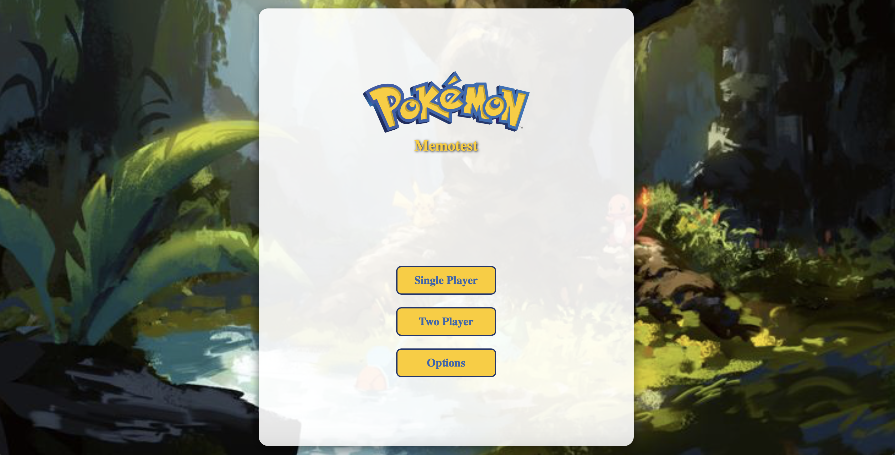
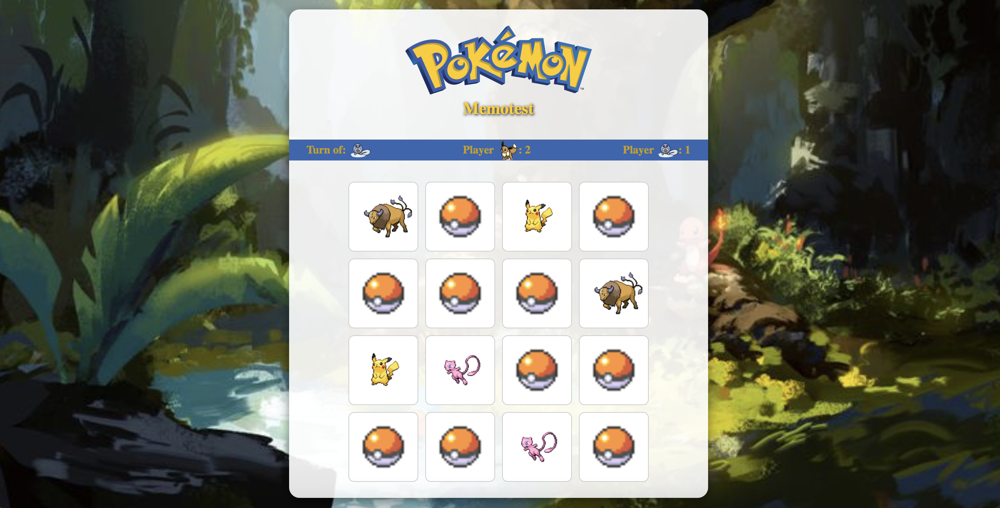

# Pokémon Memotest Game





## Instalación y configuración

1. Clona este repositorio:
   ```bash
   https://github.com/ivanmoroni92/unq-ui-ivan-moroni-trabajo-final.git
   ```
2. Accede al directorio del proyecto:
   ```bash
   cd unq-ui-ivan-moroni-trabajo-final
   ```
3. Instala las dependencias:
   ```bash
   npm install
   ```
4. Inicia el Juego:
   ```bash
   npm start
   ```

---

## Scripts disponibles

- `npm run dev`: Inicia el servidor de desarrollo.
- `npm run build`: Genera una versión optimizada para producción.
- `npm run preview`: Inicia el servidor para probar la versión de producción.

---

## Estructura del proyecto

```plaintext
/src
|-- assets
|   |-- images
|-- components
|   |-- Buttons
|   |-- ImagePokemon
|   |-- PlayGame
|   |-- StartGame
|   |-- EndGame
|-- constants
|   |-- colors.js
|-- Hook
|   |-- GameContext.js
|-- services
|   |-- pokemon
|-- utils
|-- App.jsx
|-- main.jsx
|-- mixins.js
```

---

## Gameplay

1. **Inicio**: Elige el modo de juego (único jugador o multijugador).
2. **Opciones**: Selecciona el nivel de dificultad.
3. **Jugabilidad**: Haz clic en las cartas para voltearlas y encuentra las parejas. En modo multijugador, los turnos alternan automáticamente.
4. **Fin del juego**: Se muestra al ganador con los puntos obtenidos por el jugador.

---

¡Disfrútalo y reta a tus amigos!
